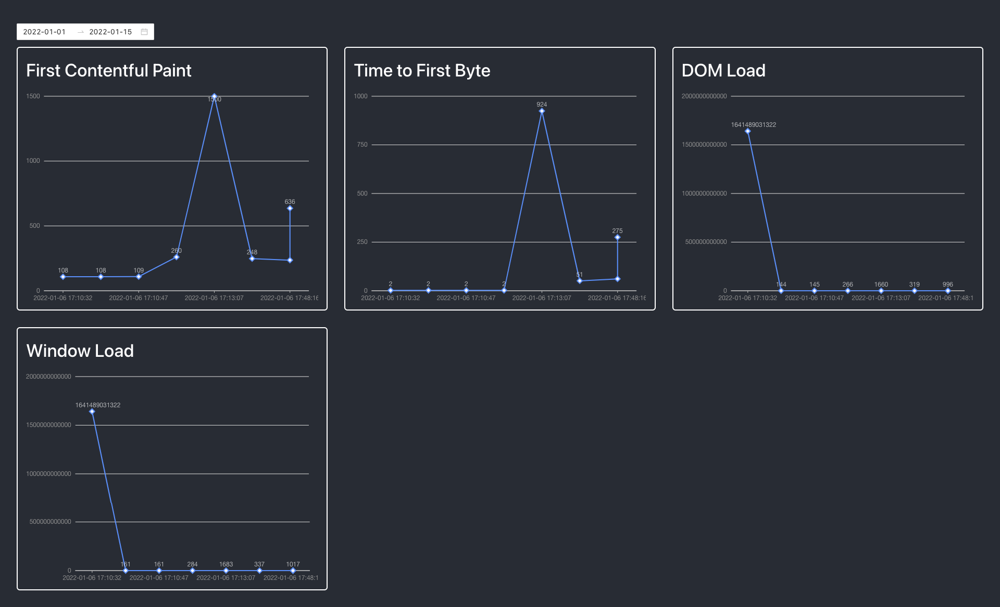

# Perf Analytics

Analyse the performance of your application.

## Lib

- Language: JavaScript

- Path: ./perf-analytics/index.js

- Demo: [Netlify](https://hopeful-heisenberg-004be0.netlify.app/)

**Usage:**

```bash
cd perf-analytics
npm install
npm start
```

```js
import perfAnalytics from '../dist/module.js';

window.addEventListener('unload', () => {
  perfAnalytics({ url: 'https://example.com/' });
});
```

## Backend

- Language: JavaScript

- Path: ./api/index.js

- Dependencies: Express, Mongoose

### Environment variables

`DB=mongodbConnectionURI`

**INSTALL:**

```bash
cd api
npm install
npm run server
```

### REST API

#### GET Analytics

**Request:**

`'/api/v1/perf-analytics'`

if no query params are provided, all analytics are returned.

```js
{
  "query": {
    "from": "2022-01-02",
    "to": "2022-01-15"
  }
}
```

**Response:**

```json
[
  {
    "id": "61d72288dcefaac30b385a28",
    "FCP": 108,
    "TTFB": 2,
    "DOMLoad": 1641489031322,
    "WindowLoad": 1641489031322,
    "ResourcesLoad": 336,
    "createdAt": "2022-01-06 17:10:32",
    "request": {
      "type": "GET",
      "url": "https://perf-analytics-ercumentlacin.herokuapp.com/api/v1/perf-analytics/61d72288dcefaac30b385a28"
    }
  }
]
```

**Performance with 200 virtual users per second:**

```bash
Phase started: unnamed (index: 0, duration: 1s) 20:45:59(+0300)

Phase completed: unnamed (index: 0, duration: 1s) 20:46:00(+0300)

--------------------------------------
Metrics for period to: 20:46:10(+0300) (width: 0.252s)
--------------------------------------

vusers.created_by_name.Retrieve data: ....................... 56
vusers.created.total: ....................................... 56
vusers.failed: .............................................. 56
http.request_rate: .......................................... 56/sec
http.requests: .............................................. 56
errors.ECONNREFUSED: ........................................ 56


All VUs finished. Total time: 2 seconds

--------------------------------
Summary report @ 20:46:01(+0300)
--------------------------------

vusers.created_by_name.Retrieve data: ....................... 56
vusers.created.total: ....................................... 56
vusers.failed: .............................................. 56
http.request_rate: .......................................... 56/sec
http.requests: .............................................. 56
errors.ECONNREFUSED: ........................................ 56
```

#### POST Analytics

**Request:**

`'/api/v1/perf-analytics'`

**Request Body:**

```json
{
  "FCP": 108,
  "TTFB": 2,
  "DOMLoad": 1641489031322,
  "WindowLoad": 1641489031322,
  "ResourcesLoad": 336,
  "createdAt": "2022-01-06 17:10:32",
},
```

## Frontend

- Language: JavaScript

- Path: ./dashboard/src/index.js

- Demo: [Netlify](https://61d715a66f07b10008be446e--musing-lalande-b7546a.netlify.app/)

- Dependies: React, Ant Design,

**INSTALL:**

```bash
cd dashboard
npm install
npm run start
```

**Screenshots:**


